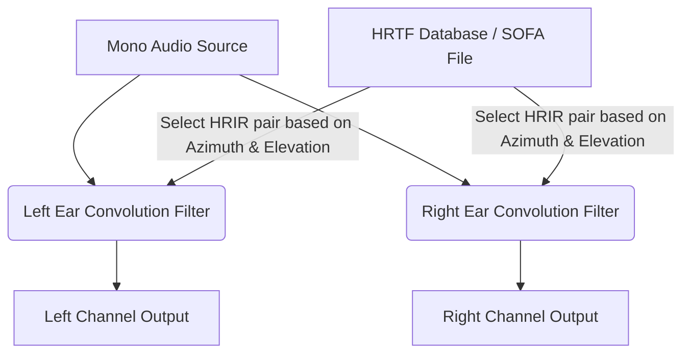
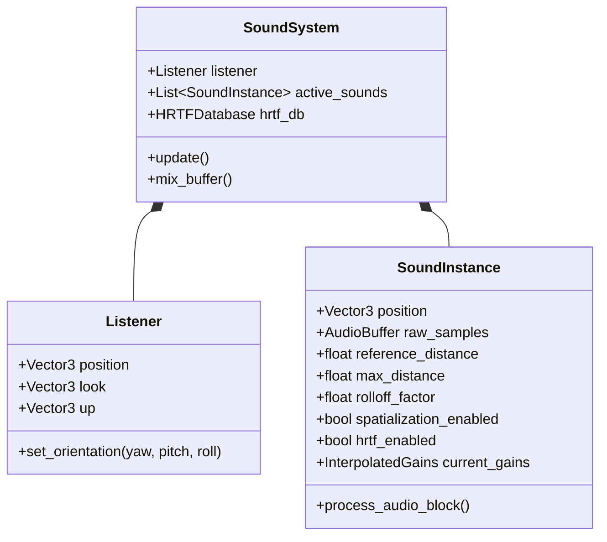

# 3D Spatial Audio & HRTF Design Fundamentals
*A comprehensive guide to mathematical models, physical principles, and software architecture for building a 3D Spatial Audio Engine.*

---

## 1. Physical Principles of Human Spatial Hearing

To design a 3D audio system, it is essential to understand how the human auditory system localizes sound sources in three-dimensional space. The brain processes three primary cues:

### 1.1. Interaural Time Difference (ITD)
ITD is the difference in arrival time of a sound wave between the left and right ears.
*   **Mechanism**: If a sound source is to the right of the listener, the wavefront must travel a longer path around the head to reach the left ear.
*   **Mathematical Approximation (Woodworth's Model)**:
    For a simplified spherical head of radius $a$ (typically $a \approx 0.0875$ meters):
    $$\text{ITD}(\theta) = \frac{a}{c} (\theta + \sin\theta)$$
    where:
    *   $\theta$ is the azimuth angle in radians (0 directly ahead, $\pi/2$ directly to the right).
    *   $c$ is the speed of sound in air ($\approx 343 \text{ m/s}$ at $20^\circ\text{C}$).
*   **Significance**: ITD is the dominant localization cue for low frequencies (below $\approx 1500\text{ Hz}$). At higher frequencies, the wavelength of the sound is smaller than the diameter of the head, causing phase ambiguities.

### 1.2. Interaural Level Difference (ILD)
ILD is the difference in sound pressure level (amplitude) between the two ears.
*   **Mechanism**: The head acts as an acoustic obstacle, absorbing and scattering high-frequency sound waves. This creates an **acoustic shadow** (attenuation) on the side opposite to the sound source.
*   **Significance**: ILD is the dominant localization cue for high frequencies (above $\approx 1500\text{ Hz}$). Low-frequency waves have wavelengths larger than the head and easily bend around it via diffraction, resulting in negligible ILD.

### 1.3. Spectral Cues (Pinna Reflections)
*   **Mechanism**: The outer ear (pinna), head, and torso act as direction-dependent acoustic filters. They attenuate and boost specific frequency bands based on the elevation and azimuth of the sound source.
*   **Significance**: Spectral cues are crucial for resolving the **Cone of Confusion** (where ITD and ILD are identical, such as directly in front vs. directly behind) and for perceiving elevation (up vs. down).

---

## 2. Coordinate Systems & Spatial Vectors

An audio engine must translate virtual 3D coordinates into relative distances and angles.

### 2.1. Coordinate Conventions
Coordinate systems can be **Right-Handed** or **Left-Handed**. It is critical to establish a consistent convention.

#### Standard Left-Handed System (Common in NVGT/BGT & DirectX)
*   **X axis**: Left / Right (positive pointing right)
*   **Y axis**: Depth / Forward (positive pointing forward)
*   **Z axis**: Height / Elevation (positive pointing up)

#### Standard Right-Handed System (Common in OpenGL & OpenAL)
*   **X axis**: Left / Right (positive pointing right)
*   **Y axis**: Height / Elevation (positive pointing up)
*   **Z axis**: Depth / Backward (positive pointing backward, i.e., forward is $-Z$)

*Design Recommendation*: Always map inputs to a consistent internal coordinate system before performing calculations.

### 2.2. Listener and Source Representation
*   **Listener State**:
    *   Position Vector: $\mathbf{P}_L = [x_L, y_L, z_L]^T$
    *   Look (Forward) Vector: $\mathbf{U}_F = [u_{Fx}, u_{Fy}, u_{Fz}]^T$ (unit vector pointing in the direction the listener is looking)
    *   Up Vector: $\mathbf{U}_U = [u_{Ux}, u_{Uy}, u_{Uz}]^T$ (unit vector pointing directly "up" from the listener's head, orthogonal to $\mathbf{U}_F$)
*   **Source State**:
    *   Position Vector: $\mathbf{P}_S = [x_S, y_S, z_S]^T$

### 2.3. Relative Position Calculation
To calculate the audio cues, the source position must be transformed into the **Listener's Local Coordinate System**.

1.  **Translation**: Calculate the relative displacement vector:
    $$\mathbf{D} = \mathbf{P}_S - \mathbf{P}_L$$
2.  **Rotation (Projection)**: Project the displacement vector onto the listener's orientation axes.
    *   The listener's local coordinate frame is defined by three orthonormal vectors:
        *   **Forward**: $\mathbf{e}_F = \mathbf{U}_F$
        *   **Up**: $\mathbf{e}_U = \mathbf{U}_U$
        *   **Right**: $\mathbf{e}_R = \mathbf{e}_F \times \mathbf{e}_U$ (using cross product)
    *   The relative local coordinate vector $\mathbf{D}_{\text{local}} = [x', y', z']^T$ is calculated via dot products:
        $$x' = \mathbf{D} \cdot \mathbf{e}_R \quad (\text{Right/Left axis})$$
        $$y' = \mathbf{D} \cdot \mathbf{e}_F \quad (\text{Forward/Backward axis})$$
        $$z' = \mathbf{D} \cdot \mathbf{e}_U \quad (\text{Up/Down axis})$$

### 2.4. Calculating Spherical Coordinates (Azimuth & Elevation)
From $\mathbf{D}_{\text{local}} = [x', y', z']$, compute:
*   **Distance ($d$)**:
    $$d = \|\mathbf{D}_{\text{local}}\| = \sqrt{(x')^2 + (y')^2 + (z')^2}$$
*   **Azimuth Angle ($\theta$)**: The angle in the horizontal plane ($x'y'$ plane), typically measured from the forward vector ($y'$).
    $$\theta = \text{atan2}(x', y')$$
    *   $\theta = 0$: Directly in front.
    *   $\theta = \pi/2$ ($+90^\circ$): Directly to the right.
    *   $\theta = -\pi/2$ ($-90^\circ$): Directly to the left.
    *   $\theta = \pm\pi$ ($\pm 180^\circ$): Directly behind.
*   **Elevation Angle ($\phi$)**: The angle above or below the horizontal plane.
    $$\phi = \arcsin\left(\frac{z'}{d}\right)$$
    *   $\phi = 0$: Eye level.
    *   $\phi = \pi/2$ ($+90^\circ$): Directly overhead.
    *   $\phi = -\pi/2$ ($-90^\circ$): Directly below.

---

## 3. Distance Attenuation Models

As sound travels through the air, it loses energy. A 3D audio engine simulates this using distance attenuation curves.

### 3.1. Parameters
*   $d$: Current distance between source and listener.
*   $d_{\text{ref}}$ (`reference_distance`): The threshold distance. At or below this distance, the gain remains at unity ($1.0$ or $0\text{ dB}$).
*   $d_{\text{max}}$ (`max_distance`): The distance beyond which the gain either stops decreasing or falls to zero (depending on clamping rules).
*   $R$ (`rolloff_factor`): Controls the rate of decay. Higher values cause faster volume drop-offs.

### 3.2. Models and Equations

#### 3.2.1. Inverse Distance Model (Physical Simulation)
This model simulates the physics of sound propagation in a free field (Inverse-Square Law, where sound pressure drops by $6\text{ dB}$ for every doubling of distance).
$$\text{Gain}(d) = \frac{d_{\text{ref}}}{d_{\text{ref}} + R \cdot (\max(d, d_{\text{ref}}) - d_{\text{ref}})}$$

*   *Clamped Variation*: To prevent infinite calculation or extremely quiet signals from wasting CPU cycles:
    $$d_{\text{clamped}} = \min(\max(d, d_{\text{ref}}), d_{\text{max}})$$
    $$\text{Gain}(d) = \frac{d_{\text{ref}}}{d_{\text{ref}} + R \cdot (d_{\text{clamped}} - d_{\text{ref}})}$$

#### 3.2.2. Linear Attenuation Model
Useful for gameplay-centric spatialization where audio must fade out completely at a precise boundary.
$$\text{Gain}(d) = 1.0 - R \cdot \frac{d_{\text{clamped}} - d_{\text{ref}}}{d_{\text{max}} - d_{\text{ref}}}$$
where the output is clamped to $[0.0, 1.0]$.

#### 3.2.3. Exponential Distance Model
Simulates rapid decay, suitable for dampening through obstacles or materials.
$$\text{Gain}(d) = \left( \frac{\max(d, d_{\text{ref}})}{d_{\text{ref}}} \right)^{-R}$$

---

## 4. Amplitude Panning Algorithms (Stereo/Multi-channel)

If the output is played through loudspeakers (or standard non-HRTF headphones), the engine must distribute the mono signal across channels.

### 4.1. Equal Power Panning (Stereo)
For a simple stereo panning setup, the total power of the left and right channels must remain constant ($L^2 + R^2 = 1.0$) as the sound pans, preventing a volume drop in the center (known as the "center-channel dip").

Given the normalized pan value $p \in [-1.0, 1.0]$ (where $-1$ is full left, $0$ is center, and $1$ is full right):
1.  Map $p$ to an angle $\alpha \in [0, \pi/2]$:
    $$\alpha = \frac{p + 1}{2} \cdot \frac{\pi}{2}$$
2.  Calculate gains:
    $$\text{Gain}_{\text{Left}} = \cos(\alpha)$$
    $$\text{Gain}_{\text{Right}} = \sin(\alpha)$$

### 4.2. Vector Base Amplitude Panning (VBAP)
Used for arbitrary 2D or 3D speaker layouts. It selects the 2 nearest speakers (for 2D) or 3 nearest speakers (for 3D) surrounding the target direction and computes linear gain factors.
*   Let $\mathbf{l}_1, \mathbf{l}_2$ be unit vectors pointing to two adjacent loudspeakers.
*   Let $\mathbf{p}$ be the unit vector pointing in the direction of the target virtual sound source.
*   Solve the linear equation for gains $g_1, g_2$:
    $$\mathbf{p} = g_1 \mathbf{l}_1 + g_2 \mathbf{l}_2 = \begin{bmatrix} \mathbf{l}_1 & \mathbf{l}_2 \end{bmatrix} \begin{bmatrix} g_1 \\ g_2 \end{bmatrix}$$
    $$\begin{bmatrix} g_1 \\ g_2 \end{bmatrix} = \begin{bmatrix} \mathbf{l}_1 & \mathbf{l}_2 \end{bmatrix}^{-1} \mathbf{p}$$
*   Normalize the gains to preserve energy:
    $$g'_i = \frac{g_i}{\sqrt{g_1^2 + g_2^2}}$$

---

## 5. Binaural Rendering & HRTF (Head-Related Transfer Function)

Binaural rendering recreates the acoustic wavefronts at the listener's eardrums using headphones, producing highly convincing 3D positioning (including height and back/front).



### 5.1. The HRTF/HRIR Concept
*   **HRIR (Head-Related Impulse Response)**: The temporal representation of pinna/torso filtering. It is an impulse response (a short FIR filter, e.g., 128 to 512 samples long at 48 kHz) measured for a specific azimuth $\theta$ and elevation $\phi$ at the entrance of the ear canal.
*   **HRTF (Head-Related Transfer Function)**: The frequency domain representation of HRIR (obtained via Fast Fourier Transform).
    $$\text{HRTF}(f, \theta, \phi) = \mathcal{F}\{\text{HRIR}(t, \theta, \phi)\}$$

### 5.2. Time-Domain Convolution Rendering
To place a mono input signal $s(t)$ at a target direction $(\theta, \phi)$:
1.  **Lookup**: Retrieve the matching left-ear impulse response $h_L(t, \theta, \phi)$ and right-ear impulse response $h_R(t, \theta, \phi)$ from the HRTF database.
2.  **Interpolation**: Since the database contains measurements at discrete grid coordinates (e.g., every $5^\circ$), the engine must interpolate between the nearest measured points to prevent audio clicks when moving.
    *   *Linear Interpolation of HRIRs*:
        $$h(t) = (1 - w)h_1(t) + w h_2(t)$$
3.  **Convolution**: Convolve the input signal with the selected HRIR filters.
    $$y_L(t) = s(t) * h_L(t, \theta, \phi) = \sum_{\tau=0}^{M-1} s(t - \tau) h_L(\tau, \theta, \phi)$$
    $$y_R(t) = s(t) * h_R(t, \theta, \phi) = \sum_{\tau=0}^{M-1} s(t - \tau) h_R(\tau, \theta, \phi)$$
    where $M$ is the length of the HRIR filter.

### 5.3. Latency & Partitioned FFT Convolution
*   Convolving long audio signals with FIR filters in the time domain is CPU-intensive ($O(N^2)$ complex operations).
*   **Solution**: Use **Fast Fourier Transform (FFT)** based convolution (overlap-add or overlap-save methods) to perform multiplication in the frequency domain ($O(N \log N)$ complexity).
*   To keep latency low, the engine splits the HRIR into smaller blocks (Uniformly Partitioned Block Convolution) so that processing can occur without waiting for large buffers to fill.

---

## 6. Core Architecture of a 3D Audio Engine

A modular 3D audio system consists of three main components: the **Listener**, the **Sound Instance**, and the **System Mixer**.



### 6.1. The Main Update Loop (Real-time Frame)
At every game loop tick (frame updates, e.g., every 16ms or 60Hz), the engine must recalculate the geometry metrics for all active sound instances:

```python
def update_system():
    # 1. Update listener's orthonormal coordinate frame
    right_vector = cross_product(listener.look, listener.up)
    
    # 2. Update each active spatialized sound
    for sound in active_sounds:
        if not sound.spatialization_enabled:
            # Bypass spatial calculations, apply default stereo pan
            continue
            
        # Calculate displacement relative to listener
        displacement = sound.position - listener.position
        
        # Project displacement vector to Listener's local frame
        local_x = dot_product(displacement, right_vector)
        local_y = dot_product(displacement, listener.look)
        local_z = dot_product(displacement, listener.up)
        
        # Compute polar coordinates
        distance = sqrt(local_x**2 + local_y**2 + local_z**2)
        
        # Calculate Distance Attenuation
        gain = calculate_attenuation(distance, sound.reference_distance, sound.max_distance, sound.rolloff_factor)
        
        if sound.hrtf_enabled:
            # Calculate Azimuth and Elevation
            azimuth = atan2(local_x, local_y)
            elevation = asin(local_z / max(distance, 0.0001))
            
            # Fetch and queue new HRIR filters for convolution
            sound.update_hrtf_filters(azimuth, elevation, gain)
        else:
            # Fall back to panning
            pan = local_x / max(distance, 0.0001) # Clamped to [-1.0, 1.0]
            sound.update_stereo_panning(pan, gain)
```

### 6.2. The Audio Rendering Thread (Block Processing)
Audio hardware requests blocks of samples (typically every 128, 256, or 512 frames, equivalent to $\approx 5.3\text{ms}$ at 48kHz). This thread runs independently of the main game thread to prevent audio stuttering (dropouts).

```
[For each Audio Block Request]
  │
  ├─► Clear Main Mix Buffer
  │
  ├─► For each SoundInstance:
  │     │
  │     ├─► Read next raw Mono audio samples
  │     │
  │     ├─► Apply Volume Envelope (linear smoothing of gain changes)
  │     │
  │     ├─► If HRTF Enabled:
  │     │     └─► Convolve mono samples with Interpolated Left/Right HRIR
  │     │
  │     ├─► Else (Panning Enabled):
  │     │     └─► Multiply mono samples by Left/Right panning coefficients
  │     │
  │     └─► Accumulate resulting Stereo samples to Main Mix Buffer
  │
  └─► Output mixed buffer to soundcard
```

### 6.3. Essential Code-Level Safeguards

1.  **Interpolating Gain Changes (Zipper Noise Avoidance)**:
    Never update volume, pan coefficients, or HRTF filters abruptly between blocks. If a source moves from left to right, interpolate the gain values smoothly over the samples within the current block:
    $$g[n] = g_{\text{start}} + \frac{n}{N} (g_{\text{end}} - g_{\text{start}})$$
    where $n$ is the sample index within the block of size $N$.
2.  **Divide-by-Zero Protection**:
    Always safeguard against coordinate divisions when a sound source is exactly at the same coordinate as the listener ($d \to 0$):
    $$d_{\text{safe}} = \max(d, 0.00001)$$
3.  **Phase Alignment**:
    When interpolating between two HRIR filters, make sure their time-of-arrival (delay) matches, or cross-fade the outputs in the time domain. Direct linear interpolation of HRIR coefficients with differing time delays will cause phase cancellation (comb filtering).

---
*This specification can be ingested by any LLM to construct a complete, low-level spatializer in languages like C++, Python, Rust, or AngelScript.*
